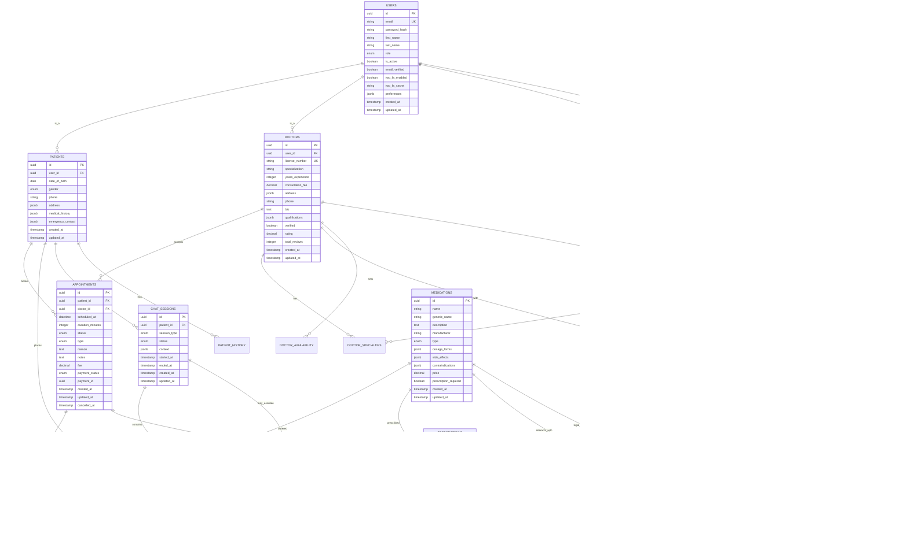

# Medical Platform - Complete Backend Architecture

## Project Structure
```
medical-platform/
├── app/
│   ├── __init__.py
│   ├── main.py
│   ├── config/
│   │   ├── __init__.py
│   │   ├── settings.py
│   │   └── database.py
│   ├── core/
│   │   ├── __init__.py
│   │   ├── security.py
│   │   ├── middleware.py
│   │   └── dependencies.py
│   ├── models/
│   │   ├── __init__.py
│   │   ├── user.py
│   │   ├── doctor.py
│   │   ├── appointment.py
│   │   ├── medication.py
│   │   └── chat.py
│   ├── schemas/
│   │   ├── __init__.py
│   │   ├── user.py
│   │   ├── auth.py
│   │   ├── doctor.py
│   │   ├── appointment.py
│   │   └── medication.py
│   ├── api/
│   │   ├── __init__.py
│   │   ├── v1/
│   │   │   ├── __init__.py
│   │   │   ├── auth.py
│   │   │   ├── users.py
│   │   │   ├── doctors.py
│   │   │   ├── appointments.py
│   │   │   ├── medications.py
│   │   │   ├── chat.py
│   │   │   └── dashboard.py
│   ├── services/
│   │   ├── __init__.py
│   │   ├── auth_service.py
│   │   ├── user_service.py
│   │   ├── doctor_service.py
│   │   ├── appointment_service.py
│   │   ├── medication_service.py
│   │   ├── chat_service.py
│   │   ├── geo_service.py
│   │   ├── payment_service.py
│   │   └── notification_service.py
│   ├── utils/
│   │   ├── __init__.py
│   │   ├── validators.py
│   │   ├── encryption.py
│   │   ├── logger.py
│   │   └── helpers.py
│   └── tests/
│       ├── __init__.py
│       ├── conftest.py
│       ├── test_auth.py
│       ├── test_users.py
│       └── test_appointments.py
├── docker/
│   ├── Dockerfile
│   ├── docker-compose.yml
│   ├── docker-compose.prod.yml
│   └── nginx/
│       └── nginx.conf
├── k8s/
│   ├── namespace.yaml
│   ├── configmap.yaml
│   ├── secrets.yaml
│   ├── deployment.yaml
│   ├── service.yaml
│   └── ingress.yaml
├── migrations/
│   └── alembic/
├── docs/
│   ├── API.md
│   ├── SECURITY.md
│   └── DEPLOYMENT.md
├── requirements.txt
├── requirements-dev.txt
├── .env.example
├── .gitignore
├── README.md
└── Makefile
```

## High-Level Architecture


## Database Entity Relationship Diagram



## Technology Stack

### Core Technologies
- **Framework**: FastAPI 0.104+
- **Database**: PostgreSQL 15+
- **ORM**: SQLAlchemy 2.0 with Alembic
- **Cache**: Redis 7+
- **Message Queue**: Celery with Redis
- **Search**: Elasticsearch 8+
- **Container**: Docker & Docker Compose
- **Orchestration**: Kubernetes

### Security
- **Authentication**: JWT with refresh tokens
- **Password Hashing**: Argon2
- **2FA**: TOTP (Time-based OTP)
- **Encryption**: AES-256-GCM for data at rest
- **TLS**: TLS 1.3 minimum

### Monitoring & Observability
- **Metrics**: Prometheus + Grafana
- **Logging**: ELK Stack (Elasticsearch, Logstash, Kibana)
- **Tracing**: Jaeger
- **Health Checks**: Custom health endpoints

### External Integrations
- **Payment**: Stripe API
- **Geolocation**: Google Maps API
- **Email**: SendGrid
- **SMS**: Twilio
- **File Storage**: AWS S3 or MinIO

## Key Features

### Authentication & Authorization
- JWT access tokens (15 min expiry)
- Refresh tokens (30 days expiry)
- Role-based access control (RBAC)
- Optional 2FA for doctors
- Session management with Redis

### Medical Chat System
- RAG system with BioMedX2 model
- Separate general chat model
- Auto-escalation triggers
- Chat history and analytics

### Appointment System
- Real-time availability checking
- Booking conflicts prevention
- Automated notifications
- Calendar integration

### Medication Store
- Country-specific legality checks
- Drug interaction warnings
- Prescription validation
- Payment processing

### Doctor Dashboard
- Patient management
- Revenue analytics
- Appointment scheduling
- Treatment outcomes

### Security Compliance
- GDPR compliant data handling
- HIPAA security requirements
- Audit logging
- Data encryption
- Rate limiting
- Input validation
